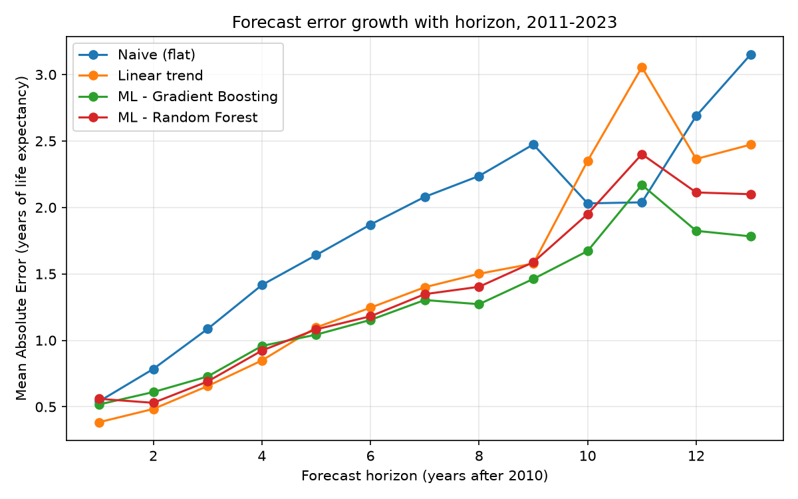
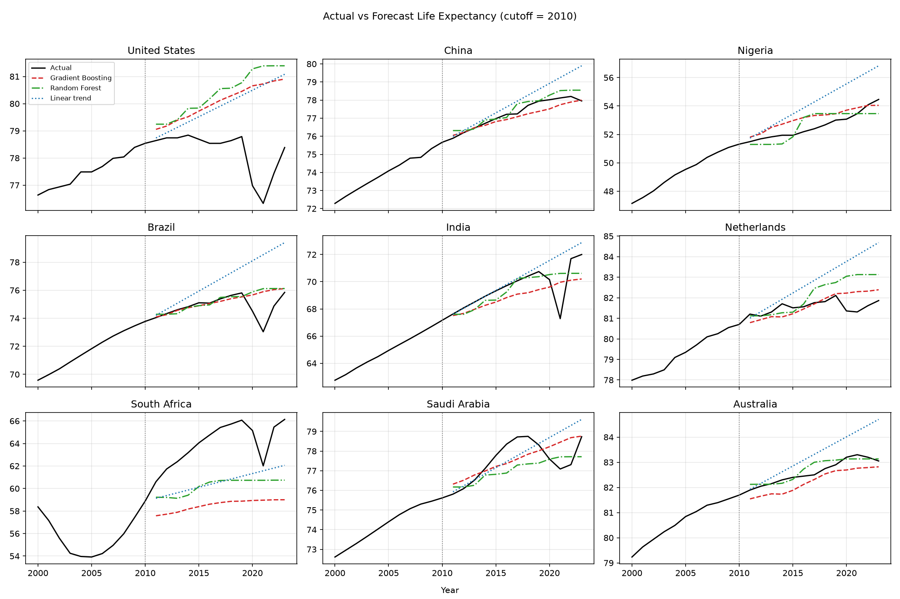

# ML Model

The following tasks describe the ML modelling to be done for this project:

Build a machine learning model to forecast life expectancy at birth for each country from 2010 to 2023, using only data available up to and including 2010. 
The objective is to assess how accurately future life expectancy trends can be predicted using historical information from the provided World Bank datasets. 
Document how well the model performed when compared with the ground truth as well as challenges and ideas for future improvement for the model.

> For the full code, all evaluation tables, and detailed discussion, see the notebook:
> **[ml-model.ipynb](./ml-model.ipynb)**

## Data

- Life expectancy at birth: total, male, female
- Crude death rate
- Total fertility rate
- Country metadata (Region, Income Group): used to drop aggregate rows (World, regions,
  income-group rollups) and keep only the 217 real countries

All the data files can be found [here](../data/).

## Approach

**Leakage-free training set — "replay history":** A single (2010 -> 2023) example per
country isn't enough to learn from. Instead, many earlier cutoff years (1975–2009) are
used to replay history: at each cutoff *Y*, trailing features are computed using only
data ≤ *Y* — life expectancy level and 10-year trend, the value 5 years earlier, fertility and death rate (level + trend), region, income group — and paired with the
**already-known** future value at *Y + h* (h = 1…13 years) as the training label. This
produces hundreds of training examples per country while guaranteeing no future
information ever enters the features. The same feature logic, applied once at cutoff =
2010, produces the real 2011–2023 forecasts.

**On male/female life expectancy:** Total life expectancy is itself a same-year, weighted
combination of male and female life expectancy, so using them (or their gap) as predictors
would be somewhat circular rather than genuinely explanatory. No male/female-derived
feature is used to forecast total life expectancy; those series are only kept in the
broader dataset for other purposes.

**Models compared:** Gradient Boosting and Random Forest regressors, compared with 5-fold
cross-validation grouped by country (`GroupKFold`), so a country's own history never leaks
into its own validation fold.

## Results

| Model                        | MAE (yrs) | RMSE (yrs) | MAPE  |
|-------------------------------|-----------|------------|-------|
| Naive (flat 2010 value)       | 1.85      | 2.91       | 2.80% |
| Linear trend extrapolation    | 1.50      | 2.89       | 2.26% |
| **ML (Gradient Boosting)**    | **1.27**  | **2.24**   | **1.97%** |
| ML (Random Forest)            | 1.375      | 2.40       | 2.10% |

Gradient Boosting wins on all three metrics and is the primary model; Random Forest's
forecasts are tracked alongside it at every evaluation level for comparison.

**By horizon:** error grows the further out the forecast goes, and spikes sharply around
2020–2021. The naive baseline briefly beats every model at horizon 11 (2021), since no
model trained on pre-2010 data could anticipate a pandemic mortality shock.

**By income group:** most accurate for high-income countries (MAE ≈ 0.76) and least
accurate for low-income countries (MAE ≈ 2.66), reflecting more volatile life-expectancy
trajectories in the latter.

**Best-forecast countries:** Virgin Islands (U.S.), Timor-Leste, Bermuda, Israel, New Zealand, China, Ireland

**Worst-forecast countries:** Haiti, South Sudan, Central African
Republic, Syria, South Africa, and several southern-African countries (Botswana, Namibia,
Zimbabwe, Eswatini)

## Plots

*Mean absolute error vs. forecast horizon (years past 2010) for each method. All models
degrade with horizon and spike around the COVID-19 years (2020–2021); Gradient Boosting is
the most resilient of the four overall.*
 
 
 

*Actual life expectancy (black) vs. Gradient Boosting, Random Forest, and linear-trend
forecasts (from a 2010 cutoff, dotted vertical line) for nine sample countries. Notice the
COVID-19 dip in several countries' actual trajectories that none of the pre-2010-trained
forecasts could foresee, and South Africa's post-2010 recovery outpacing every forecast.*

## Insights, Challenges & Ideas for Future Improvement

The ML models beat both baselines overall, and their advantage widens at longer horizons.
All models, however, share a common failure mode: **MAE spikes sharply for horizons 9–11
(2019–2021)**, i.e. around COVID-19, which is a pandemic mortality shock that is
fundamentally unforecastable from a pre-2010 trend. The ML models recover faster than the
linear baseline once the post-COVID rebound (2022–2023) starts, likely because they have
partially "learned" shock-and-recovery patterns from other historical crises embedded in
the training examples, whereas the linear model keeps extrapolating a rigid line.

**Gradient Boosting vs. Random Forest, compared on the actual 2011–2023 forecast (not just
cross-validation):** Gradient Boosting was chosen as the primary model because it had the
lower cross-validated MAE during model selection, and it remains the model this analysis
is built around. Random Forest's forecasts are shown alongside it at every level — overall, by horizon, by income group, by country, and in the sample trajectories so that it is possible to see directly how close the runner-up model comes on the real forecasting task. In practice the two track each other closely for most countries (both lean heavily on the 2010 starting level), with the gap widening mainly for the more volatile low-income / conflict-affected countries discussed above.

### Challenges

- **Structural breaks are unpredictable in principle.** COVID-19 is the clearest example:
  no amount of pre-2010 data could encode a future pandemic.
- **Heterogeneous data quality/volatility.** Small, conflict-affected, or statistically
  under-resourced countries have noisier historical series, making both their trend harder
  to learn from and their future harder to predict.
- **Long-horizon compounding error.** All models degrade with horizon; the ML model
  degrades more slowly than naive/linear extrapolation because it has learned typical
  "S-curve" flattening behaviour from many countries' trajectories, but it also is not
  immune.

### Ideas for future improvement

- **Add more predictive covariates**: including factors like GDP per capita, health
  expenditure, immunization rates, urbanization, education, and conflict indices would let
  the model anticipate more than mortality/fertility trends alone can capture.
- **Model shocks explicitly**: a two-stage model (trend + shock/anomaly detector) or
  scenario-based forecasting (best-case / trend-case / shock-case bands) would communicate
  uncertainty better than a single point forecast, especially for 2019–2021.
- **Proper time-series methods** (state-space models/Kalman filters, Prophet, ARIMA with
  exogenous regressors) per country, ensembled with the panel-ML approach, might reduce
  horizon-degradation for stable countries while keeping the ML model's edge for irregular
  ones.
- **Rolling-origin evaluation** (cutoffs at 2000, 2005, 2010, 2015…) would give a more
  robust estimate of how forecast accuracy varies with how "normal" the following years
  turn out to be — 2010 happened to be followed by an unusually disruptive decade.

---

For the complete code, feature engineering details, every evaluation table (by horizon,
by income group, by country), and further discussion, see
**[ml-model.ipynb](./ml-model.ipynb)**.
