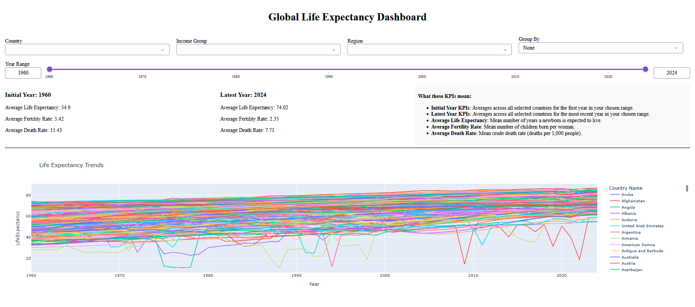
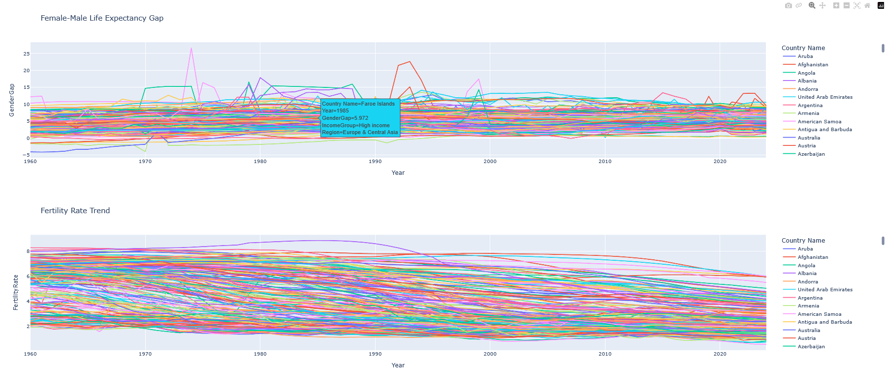
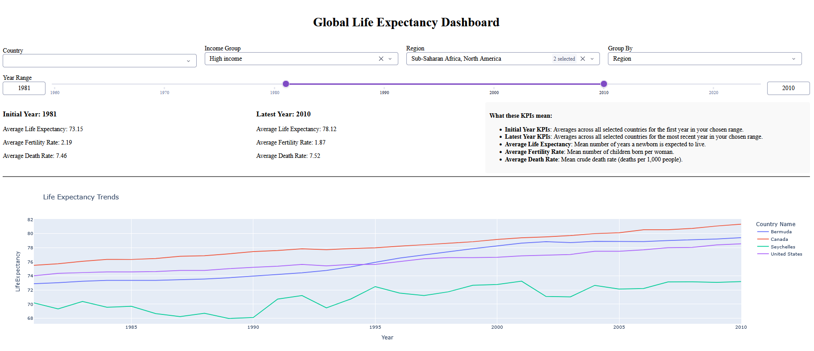
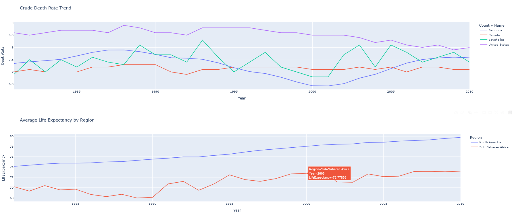

# Dashboard

The following tasks describe the what is expected from the dashboard for this project:

We would like to have a dashboard where we can monitor how life expectancy at birth, death rate, and fertility rate have changed over the years for every country. For each country we want to know to which income group it belongs. For each country we also want to know how different the life expectancy at birth is between men and women in each year. Feel free to use a dashboard library of your choice (e.g. Shiny).<br>
The dashboard should have filtering options, such as being able to filter by country, by income group and by region.<br>
As a bonus the dashboard could also have the option to group by income group and region.

## Global Life Expectancy Dashboard

We have created an interactive dashboard using **Plotly** and **Dash** for exploring how **life expectancy at birth**, **death rate**, and **fertility rate** have evolved over time for countries around the world with each country tagged by **income group** and **region**, and a built-in view of the **gender gap in life expectancy** (female vs. male).

<p align="center">
  
</p>
<p align="center">
  
</p>
<p align="center"><em>Some snapshots of the default views of the dashboard.</em></p>


This folder (`4-dashboard/`) contains everything needed to run the dashboard:

- `dashboard_data_preparation.ipynb`: Notebook that builds the aggregated dataset (`dashboard_df.csv`) from the raw World Bank indicator files.
- `dashboard_app.py` - The Dash application that reads `dashboard_df.csv` and serves the interactive dashboard.
- `dashboard_df.csv` - The pre-built (using the notebook mentiond above), ready-to-use dataset

> **You do not need to run the notebook to use the dashboard.** The aggregated dataset (`dashboard_df.csv`) is already included in this repo. The notebook is provided purely for transparency/reproducibility, in case you want to regenerate the dataset yourself.

---

### 1. What the data preparation notebook does

`dashboard_data_preparation.ipynb` combines **five World Bank datasets** plus a country metadata file into a single tidy table:

- `total_life_expectancy_at_birth.csv` : life expectancy at birth, total population.
- `male_life_expectancy_at_birth.csv` : life expectancy at birth, male.
- `female_life_expectancy_at_birth.csv` : life expectancy at birth, female.
- `death_rate_crude.csv` : crude death rate (per 1,000 people).
- `fertility_rate_total.csv` : total fertility rate (births per woman).
- `country_metadata.csv` : country-level metadata, used to attach **Income Group** and **Region** to each country, and to filter out non-country aggregates (e.g. "World", "OECD members") that have no income group.

**Processing steps:**
1. Load the raw World Bank CSVs (which come in "wide" format, one column per year) and reshape each into "long" format (one row per country/year).
2. Keep only countries that appear in the metadata file with a non-missing income group (this excludes regional/global aggregates).
3. Merge all five indicators into a single table on `Country Name`, `Country Code`, and `Year`.
4. Compute a new column, **`GenderGap`** = `FemaleLifeExpectancy − MaleLifeExpectancy` (positive = women live longer, negative = men live longer).
5. Attach `IncomeGroup` and `Region` from the metadata to every row.
6. Drop the year 2025, which is present in the raw files but entirely empty.
7. Save the final table as **`dashboard_df.csv`** in the `4-dashboard/` folder.

**To regenerate the dataset (optional):** open and run all cells in `dashboard_data_preparation.ipynb` from within `4-dashboard/`. It will overwrite `dashboard_df.csv` in place.

---

### 2. What the dashboard does

`dashboard_app.py` is a single-page **Dash** app (built with `dash`, `plotly.express`, and `pandas`) that loads `dashboard_df.csv` and renders an interactive dashboard with the following pieces:

#### Filters (top of the page)
- **Country** : multi-select dropdown, filter to one or more specific countries.
- **Income Group** : multi-select dropdown (High income, Upper middle income, Lower middle income and Low income).
- **Region** : multi-select dropdown (e.g. Europe & Central Asia, Sub-Saharan Africa, etc.).
- **Group By** : single-select dropdown to aggregate the data by **Income Group** or **Region** instead of viewing individual countries. All filters can be combined; leaving a dropdown empty means "include everything."
- **Year Range slider** : restricts every chart and KPI to a selected span of years.

#### KPI summary cards
Two side-by-side KPI panels are computed dynamically from the currently filtered data:
- **Initial Year KPIs** : average life expectancy, fertility rate, and death rate across the selected countries, for the *first* year in the selected range.
- **Latest Year KPIs** : the same three averages, for the *most recent* year in the selected range.

This lets a viewer immediately see how the picture has changed from the start to the end of the chosen period, for whatever slice of countries they've filtered to. A small info panel next to the KPIs explains what each metric means.

#### Charts
All charts update live in response to the filters and are built with `plotly.express`:
1. **Life Expectancy Trends** : line chart of life expectancy over time, one line per country.
2. **Female–Male Life Expectancy Gap** : line chart of the `GenderGap` metric over time, one line per country.
3. **Fertility Rate Trend** : line chart of fertility rate over time, one line per country.
4. **Crude Death Rate Trend** : line chart of death rate over time, one line per country.
5. **Average Life Expectancy by Income Group / Region** : when a **Group By** option is selected, this chart aggregates life expectancy by income group or region instead of showing individual countries, making it easy to compare.

### Built-in Plotly/Dash interactivity
Because the charts are standard Plotly figures rendered through Dash, viewers automatically get a number of interactive features with no extra code required:
- **Legend click-to-isolate:** clicking a country/group name in a chart's legend hides that line; **double-clicking** a legend entry isolates it, hiding every other line so the viewer can focus on just one series.
- **Hover tooltips:** hovering over any point shows its exact value, plus the extra fields passed via `hover_data` (Income Group, Region).

Apart from these, the dashboard includes the usual Plotly features such as zooming and panning, box/lasso selection, compare-on-hover mode, exporting charts to PNG etc.

<p align="center">
  
</p>
<p align="center">
  
</p>
<p align="center"><em>Some snapshots of the dashboard with filters and group by applied.</em></p>


## Setup & running the dashboard

### Prerequisites
- **Python 3.9+** installed on your system.
- `git` installed (to clone the repository).

### Step 1 — Clone the repository

```bash
git clone https://github.com/avirupc/global-life-expectancy-analysis.git
cd global-life-expectancy-analysis
```

### Step 2 — Set up a virtual environment

Using a virtual environment keeps this project's dependencies isolated from the rest of your system.

**macOS / Linux (bash/zsh):**
```bash
python3 -m venv .venv
source .venv/bin/activate
```

**Windows (Command Prompt):**
```cmd
python -m venv .venv
.venv\Scripts\activate.bat
```

**Windows (PowerShell):**
```powershell
python -m venv .venv
.venv\Scripts\Activate.ps1
```
> If PowerShell blocks the activation script, run PowerShell as Administrator once and execute:
> `Set-ExecutionPolicy -ExecutionPolicy RemoteSigned -Scope CurrentUser`, then retry.

Once activated, your terminal prompt should be prefixed with `(.venv)`.

### Step 3 — Install dependencies

From the repository root (with the virtual environment active):

```bash
pip install -r 4-dashboard/requirements.txt
```

*(If you placed `requirements.txt` at the repo root instead, just run `pip install -r requirements.txt`.)*

### Step 4 — (Optional) Regenerate the dataset

The processed dataset (`dashboard_df.csv`) is already included in `4-dashboard/`, so this step can be skipped. If you'd like to regenerate it from the raw World Bank files in `data/`:

```bash
cd 4-dashboard
jupyter notebook dashboard_data_preparation.ipynb
```
Run all cells. This overwrites `dashboard_df.csv` in the same folder.


*(Jupyter is not required if you only want to view the dashboard, it is only needed if you plan to re-run the notebook. You can install it separately with `pip install jupyter` if it is not already available on your system.  <br> **Note:** In `requirements.txt`, the Jupyter line is currently commented out. If you want to install Jupyter along with the other dependencies, simply uncomment that line before running `pip install -r requirements.txt`.)*


### Step 5 — Launch the dashboard

From the `4-dashboard/` folder:

**macOS / Linux:**
```bash
cd 4-dashboard
python3 dashboard_app.py
```

**Windows:**
```cmd
cd 4-dashboard
python dashboard_app.py
```

You should see output similar to:
```
Dash is running on http://127.0.0.1:8050/
```

Open that address in your web browser to view the dashboard. Press `Ctrl+C` in the terminal to stop the server when you're done.

### Step 6 — Deactivate the environment (when finished)

```bash
deactivate
```
