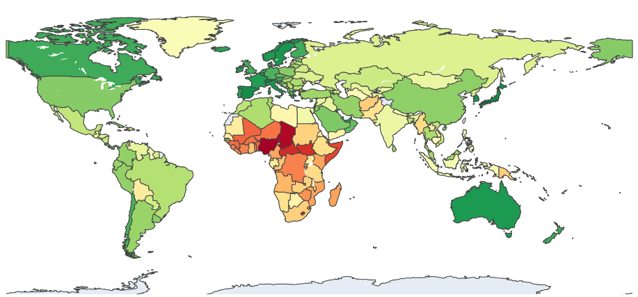
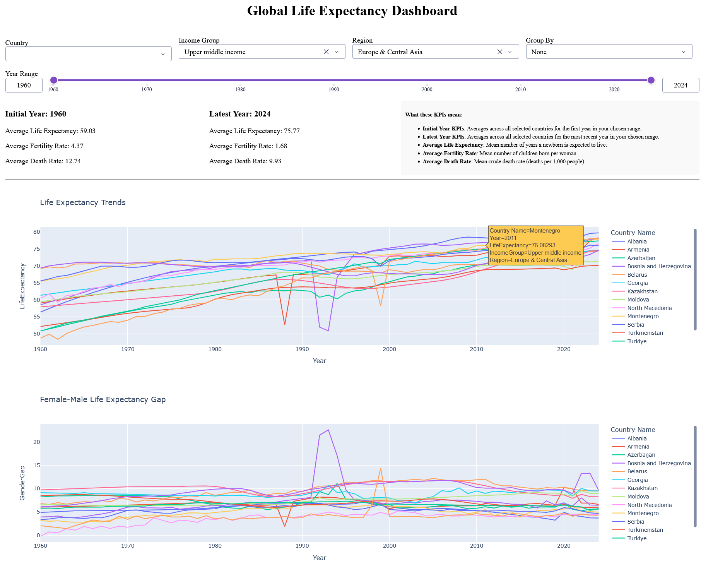

<h1 style="border-bottom:none;">Global Life Expectancy Analysis</h1>


<p align="center">
  
</p>

## Project Outline
In this project, we will dive into the story of how life expectancy has evolved across countries and over time, using real-world data as our foundation. Drawing from a collection of World Bank datasets—including life expectancy at birth (with gender breakdowns), death rates, and fertility rates—we will uncover patterns and insights that reveal broader global health trends.<br>
We intend to translate these raw datasets into meaningful visual narratives using Python as our primary tool for data processing, visualization, and dashboard creation.

A complete list of tasks for this project can be found in [tasks.md](./tasks.md).

<!-- AC9: Add world plot, dashboard -->

This project explores global life expectancy trends using World Bank data, covering statistical analysis, data visualization, machine learning forecasting, and an interactive dashboard.

## Repo Structure
 
The repo is organized into four self-contained task folders based on the four primary tasks, each with its own notebook, code script, README, and outputs:

- [`1-statistical-analysis`](./1-statistical-analysis/)
- [`2-data-visualizations`](./2-data-visualizations/)
- [`3-ml-model`](./3-ml-model/)
- [`4-dashboard`](./4-dashboard/)

#### Other directories and files:
 
- [`data/`](./data) - contains raw World Bank source data (life expectancy, death rate, fertility rate, country metadata) used across all four tasks.
- `tasks.md`- the original task descriptions for this project.

## Summary of Work

Each task folder contains a Jupyter notebook with detailed markdown commentary that explains the preprocessing steps, underlying assumptions, and rationale behind the approach.  
Additionally, every folder includes a README that highlights the work carried out, provides any supplementary notes or instructions for the viewer/user, and summarizes the key results and insights.

### 1. Statistical Analysis

[Task Folder](./1-statistical-analysis/) | [Notebook](./1-statistical-analysis/statistical-analysis.ipynb)

Finds the income group with the largest change in the female–male life expectancy gap (1960–2023) and in life expectancy variability, and identifies countries with the strongest/weakest fertility–life expectancy correlations. **Upper middle income** leads on both gap and variability change; **India** tops the correlation ranking with highest absolute correlation value (Pearson's correlation coefficient). **Belarus** comes out to be the country with lowest correlation.

### 2. Data Visualizations

[Task Folder](./2-data-visualizations/) | [Notebook](./2-data-visualizations/data-visualizations.ipynb) <br> [World Map HTML](./2-data-visualizations/world-map.html) | [World Map Image](./2-data-visualizations/world-map.png) | [Sankey Diagram HTML](./2-data-visualizations/Sankey.html) | [Sankey Diagram Image](./2-data-visualizations/Sankey.png)

Time-series trends by income group, a world map of 2023 life expectancy, and a Sankey diagram tracking how countries moved between five life-expectancy tiers from 1960 to 2023. Interactive Plotly charts are provided as HTML files (with PNG previews for GitHub).

### 3. ML Model

[Task Folder](./3-ml-model/) | [Notebook](./3-ml-model/ml-model.ipynb)

Forecasts life expectancy (2011–2023) per country using only pre-2010 data, via a "replay history" training approach with Gradient Boosting and Random Forest. Gradient Boosting shows best results (MAE 1.27 yrs vs. 1.85 for a naive baseline). Forecast accuracy is highest for high-income countries and dips sharply around COVID-19.


### 4. Dashboard


[Task Folder](./4-dashboard/) | [Data Preparation Notebook](./4-dashboard/dashboard_data_preparation.ipynb) | [App Script](./4-dashboard/dashboard_app.py)

<p align="center">
  
</p>

<p align="center"><em>Partial view of the dashboard. For full view, launch the app (instructions below).</em></p>


An interactive dashboard built using Plotly and Dash to explore life expectancy, death rate, and fertility rate by country, income group, and region, with a built-in gender-gap view and filtering/grouping options.

**Detailed instructions are provided in the folder's [README](./4-dashboard/README.md) on how to run the dashboard.**
 
## Getting started (optional)
 
You do not need to run anything to explore this project. Every notebook already contains its code, markdown explanations, and output cells, and each README summarizes the results. Cloning and setting up the environment is only needed if you want to re-run the notebooks yourself.
 
```bash
git clone https://github.com/avirupc/global-life-expectancy-analysis.git
cd global-life-expectancy-analysis
python3 -m venv .venv 
.venv\Scripts\activate.bat # For Linmux/macOS: source .venv/bin/activate  
pip install -r requirements.txt
jupyter notebook
```
 
## Viewing the dashboard
 
The dashboard is a live app, not a static notebook, so it **must be run locally** to be viewed. See [`4-dashboard/README.md`](./4-dashboard/README.md) for full step-by-step setup and launch instructions.
 
